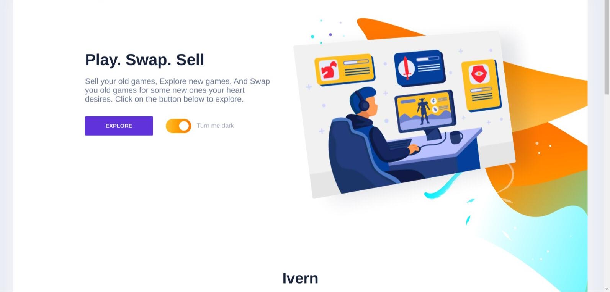
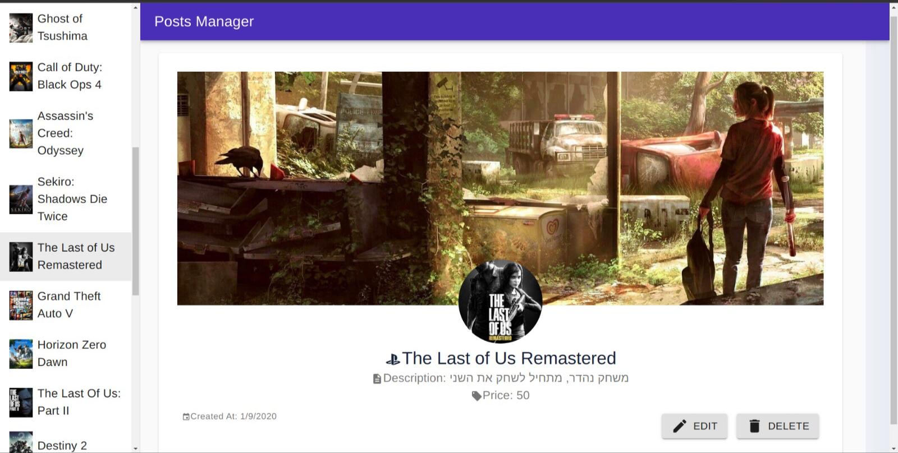

### IVERN APP

### UNDER DEVELOPMENT

Ivern is a Personal Project built for your for your pocket. 
 Explore new video games, Sell your old ones, And Swap you old games for
some new ones your heart desires.

Ivern has an extensive gaming library, that's updating each day to make sure it has the most up to date video games on it.

Ivern uses a sharp and beautiful Responsive UI mainly built using Material-UI library
for ensuring an enjoying browsing experience.

Ivern is written all in TypeScript and uses the technologies down below:
React(w/Hooks and Redux)
Serverless Computing using Google Firebase
FireStore noSQL Database
Cloud Functions for API management
Auto Games fetching and updating API
Pub/Sub image uploading
Socket.io messaging
And much more!
Right now Ivern supports only Israel for use but will be supported Worldwide soon after Deployment.

All Rights reserved To David Yakir Ben Hillel as LICENSE.txt states.
